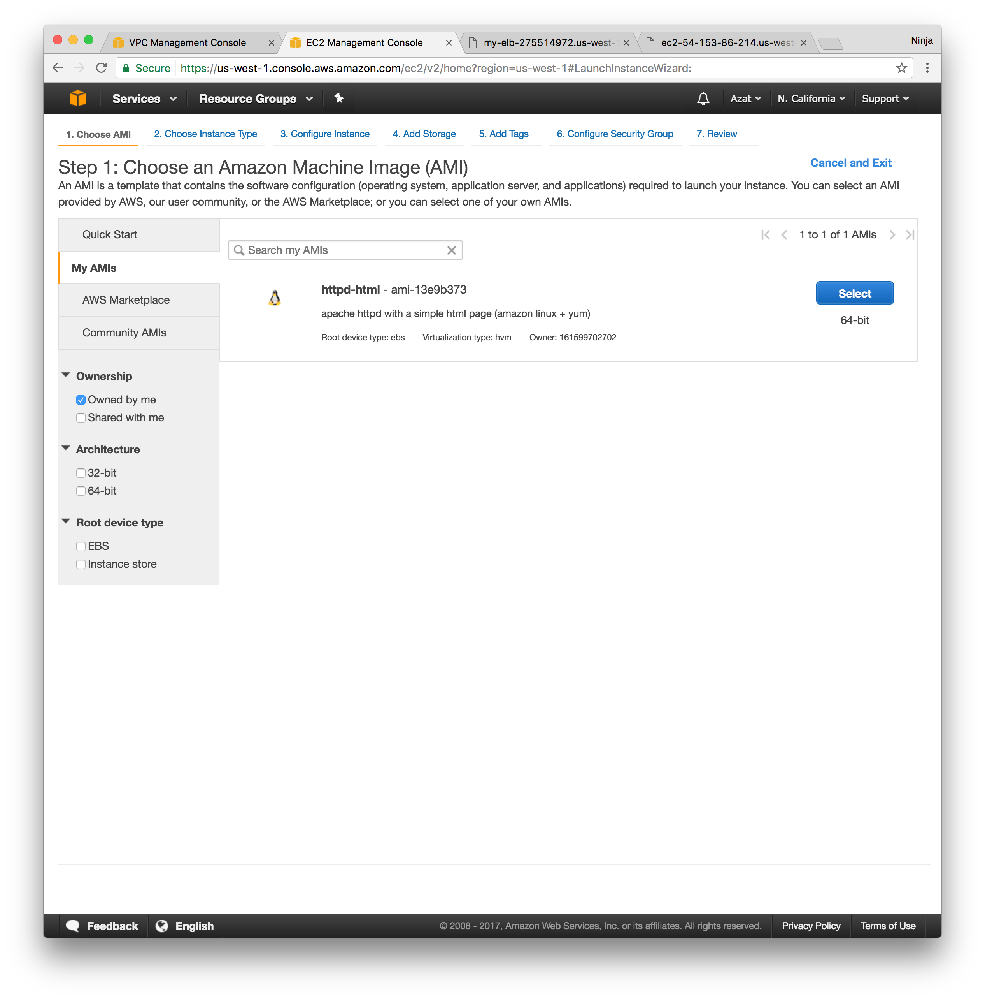
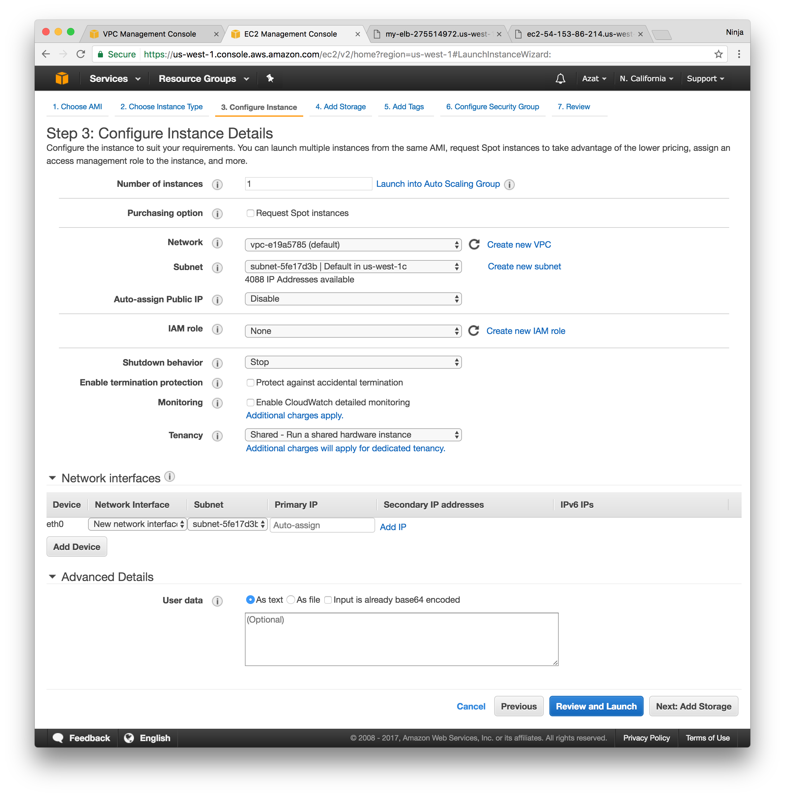
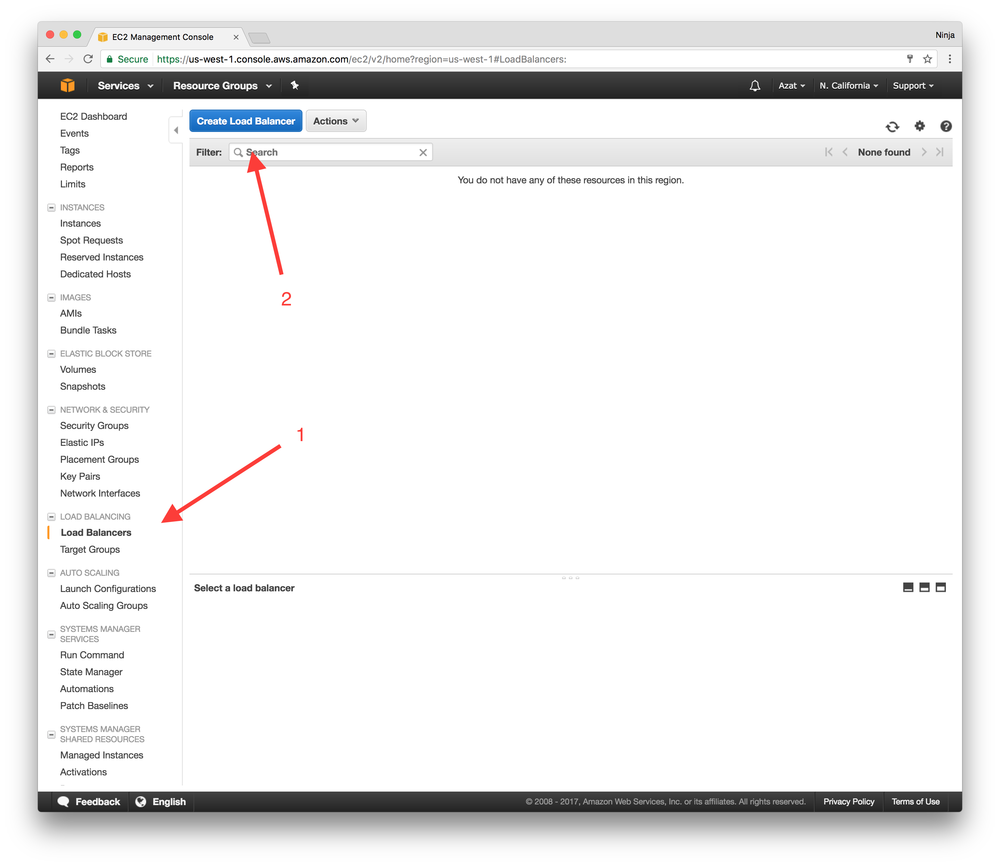
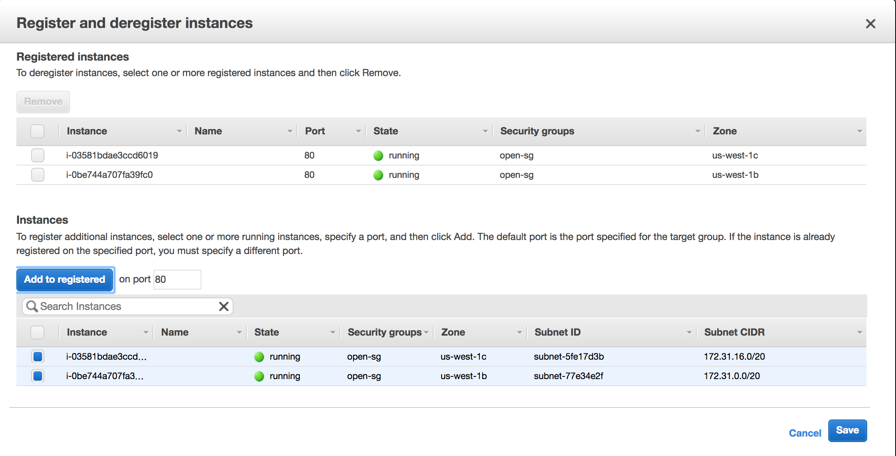
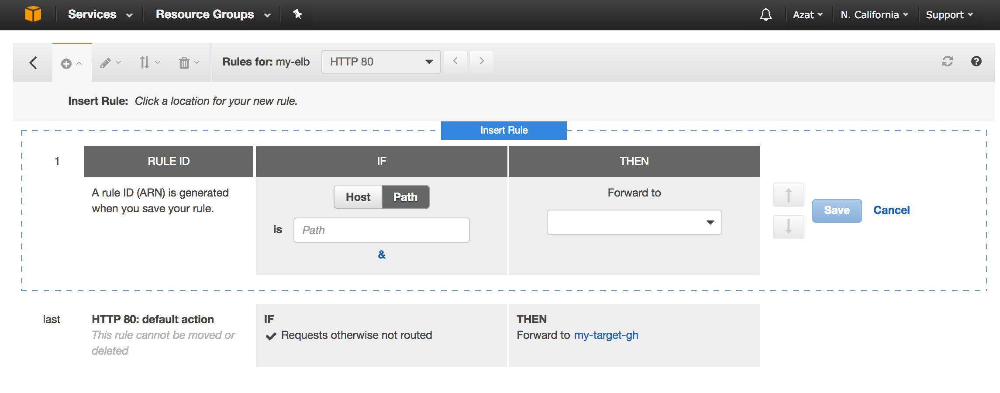

# Lab 3: ELB for Save!

One of the best practices of building highly available, robust and fail-tolerant systems is to build redundancy. And when it comes to web services, redundancy means more instances (general term nodes) which run the same code and pretty much stateless so there's no hick-ups for clients making requests to different nodes. The benefit is that if one node fails, you got another running.

Also, let's say you are publishing services like Twitter or WordPress and one of the articles published on your website became viral, there are thousands of requests per second. Also, let's assume you don't have any CDN caching, how do you scale this to your website? If you are just using a single instance and its public IP (probably EIP) - not good. A better way is to use a load balancer. It will not just distribute the traffic but also check for status health which makes your system more fail-tolerant. You can also reload and push new versions with 0-reload time if you use an ELB and multiple instances.

There are two categories of ELB: classic and app. Classic works directly with instances while app ELB works with target groups which allows for more flexibility. App ELB has more features like HTTP/2, multi-port (containers!) and path-routing which is great for microservices.

Let's implement an app ELB!

# Task

Create an app ELB with 2 targets which are Apache httpd servers in different AZs, make one fail and observe.


# Walk-through

If you would like to attempt the task, then skip the walk-through and go for the task directly. However, if you need a little bit more hand holding or you would like to look up some of the commands or code or settings, then follow the walk-through.

1. Create 2 instances with Apache httpd and hello world HTML, register them with ELB - only private IP
1. Create an app ELB with external (public) IP
1. Test that you can see the page by going to the ELB's public DNS (not IP!)
1. Stop one of the instances and see if you can still see the webpage

## 1. Create two instances

Because we will be using instances which don't have public IPs, they won't be able to fetch yum update and source code from the internet. We can just create an instance *with* a public IP first, verify that the web server is running, and then create an image of that. This is a very realistic scenario because in real life you'll be working with images to save time on launching new instances (it's faster to create an instance from an image which has an app and environment than use User Data to re-create environment anew). See [this](http://serverfault.com/questions/600987/allowing-a-private-subnet-ec2-access-to-the-internet-amazon-aws) and [this](http://serverfault.com/questions/628559/ec2-instances-in-vpc-and-access-to-the-internet) for more info.

First, create a public instance.

* AMI: Amazon Linux hvm, SSD
* Type: t2.micro
* User Data as below
* Tags: role=aws-course
* VPC and AZ: default
* Public IP: default (enabled)
* Volume: default
* Security group: open

User Data which creates an HTML page served by Apache httpd web server:

```sh
#!/bin/bash -ex
exec > >(tee /var/log/user-data.log|logger -t user-data -s 2>/dev/console) 2>&1  # get just user data logs
yum update -y				# update packager, just in case the image is outdate
yum install -y httpd 		# install apache httpd
service httpd start 		# start apache httpd
chkconfig httpd on  	# start apache httpd on every start and reboot
chkconfig --list httpd	# log the status of httpd config
# the next line will add the source code, you can also pull from GitHub, or S3
echo "<html>
<h1>This is my cool HTML page</h1>
</html>" > /var/www/html/index.html
```

Once the image is created from your new public instance, the image will be available in My AMIs tab.



Create two instances from that image. Use the following:

* AMI: your image
* VPC: same as other instance (default)
* Subnet: subnet for us-west-1c
* Public IP: disabled
* User Data: nothing (default)
* Tags: role=aws-course
* Security group: at least SSH and HTTP



Create another private instance in a different AZ (us-west-1b).


## 2. Create an app ELB

Log in into your AWS web console and navigate to the EC2 management console. In the left sidebar menu, click on *Load Balancers*, then press a blue button "Create Load Balancer" from the top menu.



The process of ELB creation is very straightforward. The first question is what type, and you select Application ELB (more features!!!). Then press "Continue" - blue button in the right bottom corner.

Then, the next five screens will require some modification from defaults. If a field is not mentioned, leave it as default or empty.

On *1. Configure Load Balancer*, make sure to have the following:

* enter name (arbitrary)
* Select internet-facing
* Select IPv4
* Listeners: HTTP port 80 (optionally, HTTPS 443 - need a key and certificate)
* VPC: same as your instances
* Availability zones: Select all two us-west-1c and us-west-1b
* Tags: role=aws-course


Skip *2. Configure Security Settings* by clicking Next if you didn't select HTTPS (requires a key and certificate - you can buy it or generate yourself).

On *3. Configure Security Groups*, select a group(s) with at least HTTP 80 and SSH 22 open.

On *4. Configure Routing*,  select "New target group" from the Target group drop down and enter name (arbitrary).

On *5. Register Targets*, add 2 Apache httpd instances to the target group.

On *6. Review*, check all the configs and then click on create button (blue). Wait, verify that you see success message and close (blue button).

You can verify all the settings again from the ELB console list view. The important thing is to have two instances from different AZs under the same ELB (in the same target group):



## 3. Test

Copy the ELB's DNS name from the Description tab in the ELB list view's bottom drawer. Paste the address in the browser and press enter. You should see: This is my cool HTML page (or whatever HTML you put on the instances).

You can also explore Listeners and Monitoring tabs. Listeners allow you to re-route to different target groups (you can have more than one target group with one IP) based on protocol, port and even path with is very useful (especially for microservices!).



## 4. Stop and test

Stop one of the instances... wait then check in the target group. It'll say that the stopped instance is unhealthy. What's good about app ELB is that it'll distribute the load cross-AZs.

The webpage should still be visible in the browser on the same ELB's URL.

Terminate instances, remove image, target group, and ELB.


# Troubleshooting

*If your private instance is not healthy*, then you might want to see the logs. Unfortunately, logs from the web console are delayed. To log in to your instance which *does not have a public IP* simply use another instance *with* a public IP. Two instances must be in the same VPC. Copy the private key to your public instance with scp where (azat-aws-course is my key name and I'm copying to the home folder of my remote machine):

```
scp -i azat-aws-course.pem azat-aws-course.pem ec2-user@ec2-54-153-86-214.us-west-1.compute.amazonaws.com:~/
```


Then connect to the private instance using the private IP (make sure the chmod is 400!):

```
cd ~
ssh -i "azat-aws-course.pem" ec2-user@ip-172-31-25-251
```

Logs will be in /var/log. If you used the provided lab User Data for this, then /var/log/user-data.log, otherwise just /var/log/cloud-init-output.log.
