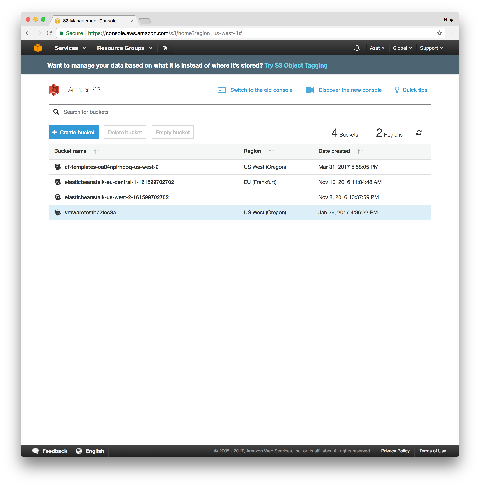
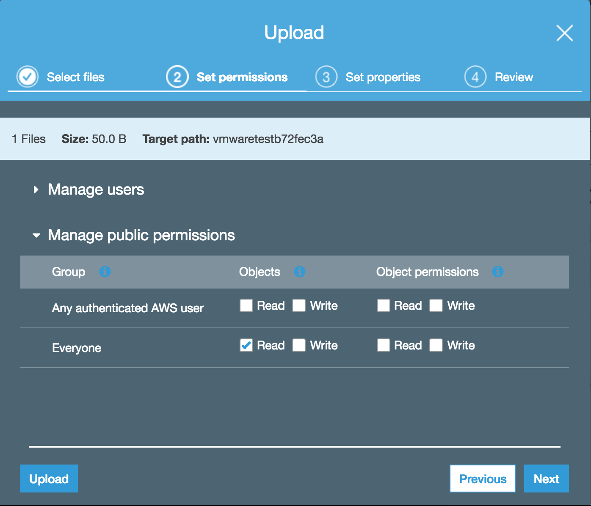
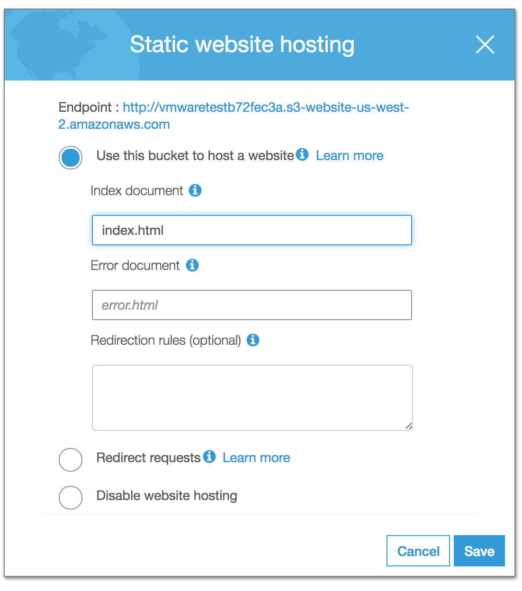

# Lab 4: Static Website Rule!

There are a lot of complexities with hosting a website. For even a simple static (no database or anything dynamic requiring server-side programming - that is no backend), developers need to have an HTTP server and configure it. For example, Apache httpd or nginx. There are a lot of configurations and it's easy to miss something, exposing your site to attackers. Also, there might be 0 day exploits and security bugs in the HTTP servers and their related modules. Finally, you need to keep an eye on the instance (that would be EC2). Is it healthy? Enough CPU? Memory? Software is a liability, not an asset so you need to think about maintenance costs. Then comes the cost of running an instance (S3 is much cheaper than EC2). 

What if you can just rent static website as a service? S3 allow you to do that. Imagine you are looking for a job and want to have a nice simple website with your name, resume, job history, projects/portfolio, and contact information. For the aforementioned reasons, you don't want to create an EC2 instance (but of course you can). Let's upload your personal website (just a single HTML page) to S3 and enable static website hosting.


# Task

Server an HTML page from S3.


# Walk-through

If you would like to attempt the task, go skip the walk-through and go to the task directly. However, if you need a little bit more hand holding or you would like to look up some of the commands or code or settings, then follow the walk-through.

1. Create an S3 bucket (or use an existing one)
2. Upload an HTML file
3. Enable static webhosting

## 1. Create S3 bucket

Log in to your AWS console and navigate to S3 service. Look for the blue button which says "Create bucket".  Bucket names are globally unique and visible to users so pick your name wisely. You can use an existing bucket if you already have one. In the screenshot below, you will see the new design (Apr 2017), you can switch to the old design as well.



## 2. Upload an HTML file

Here's the file:

```html
<html>
<h1>This is my awesome home page</h1>
</html>
```

It's just three lines. You can expand it to include your name, bio, etc., and also use a theme. [Bootswatch](https://bootswatch.com) has a good responsive (works on mobile) free static theme based on Twitter Bootstrap library. Those themes can make your page (or website) look professional and good in no time.  😎

Now, upload the HTML file into the bucket by pressing on the Upload button (surprise, surprise). Set the permission so other can access it:

 

On step 3: Set properties, leave everything as default: storage to standard and encryption to none.

 

Your file is uploaded. Congratulations. You can share it with others... but it's not a webpage yet.

## 3. Enable static webhosting

Navigate to your bucket and select Properties tab. Locate Static website hosting and click on it. Select "Use this bucket..." and type "index.html" as shown below.



You can also use redirects if you already bought a domain name (name.com, godaddy.com, etc.) for your personal home page. If you don't have a domain yet, you can use the amazonaws.com DNS (shown in the endpoint field).

 Click Save! 

The HTML file should be served as a webpage on your bucket's URL which is http://vmwaretestb72fec3a.s3-website-us-west-2.amazonaws.com in my example (http://{bucket_name}.{bucket-region-website}.amazonaws.com). The /index.html path in the URL is optional since you specified the default root document in the website hosting settings as index.html.
