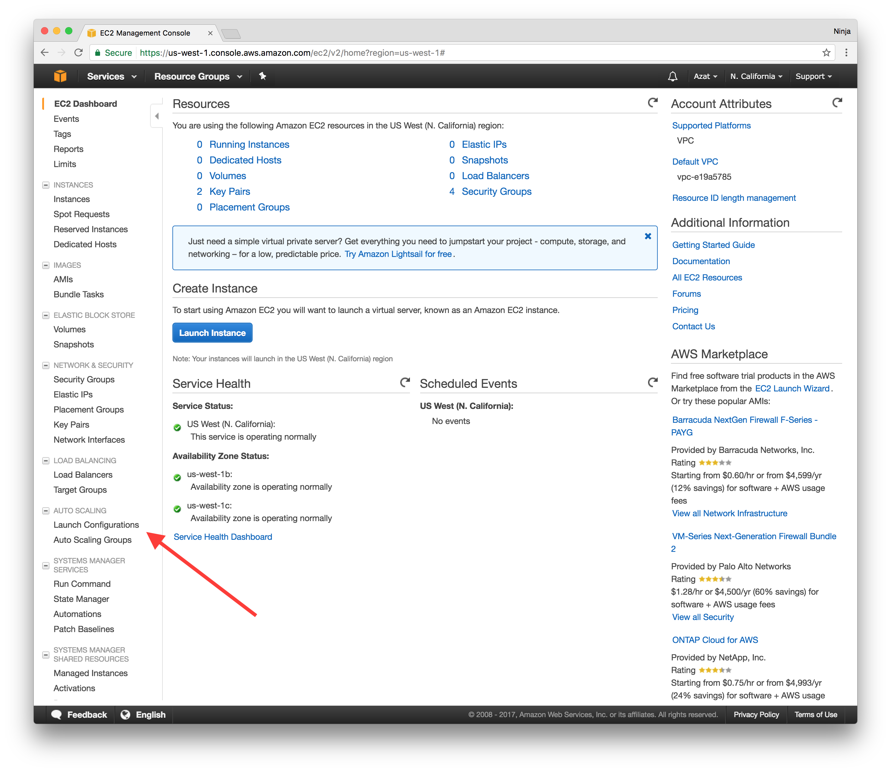
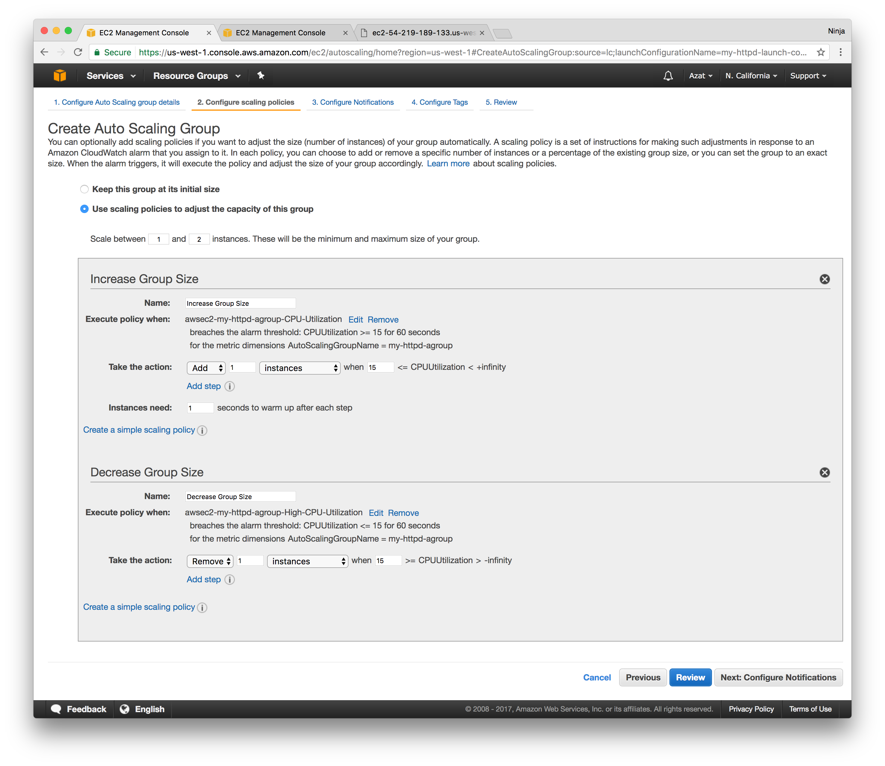
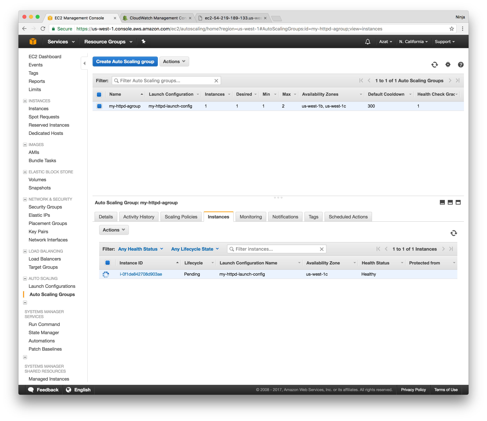
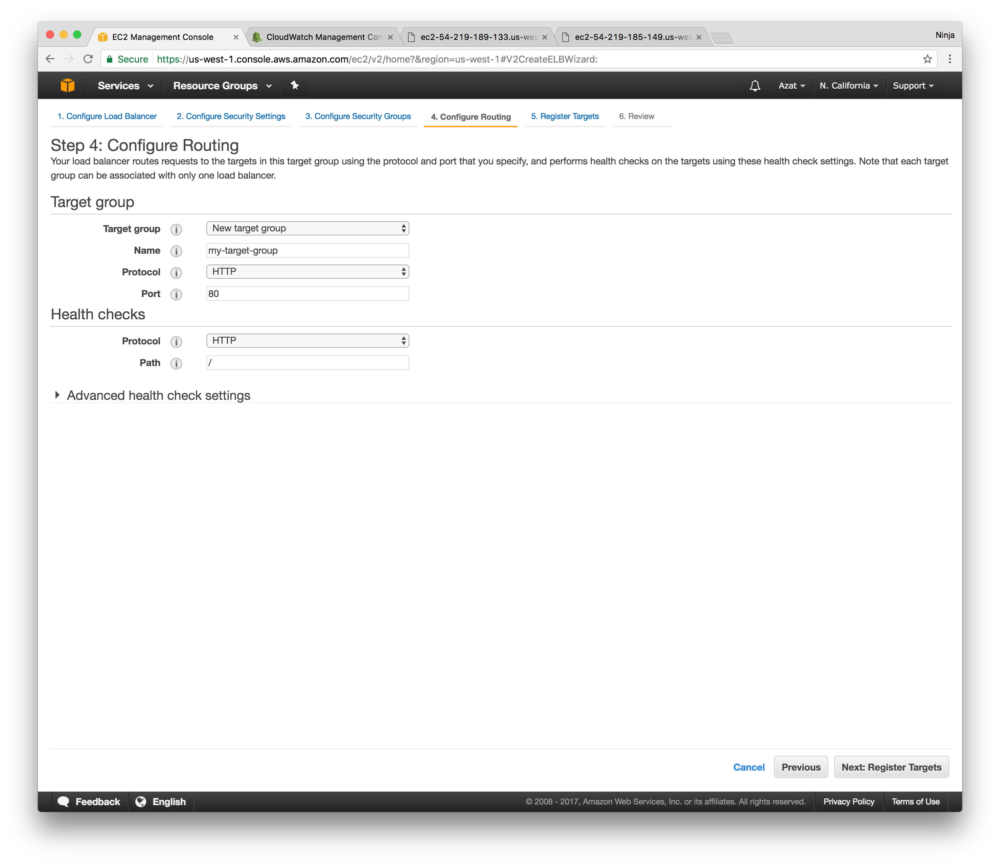
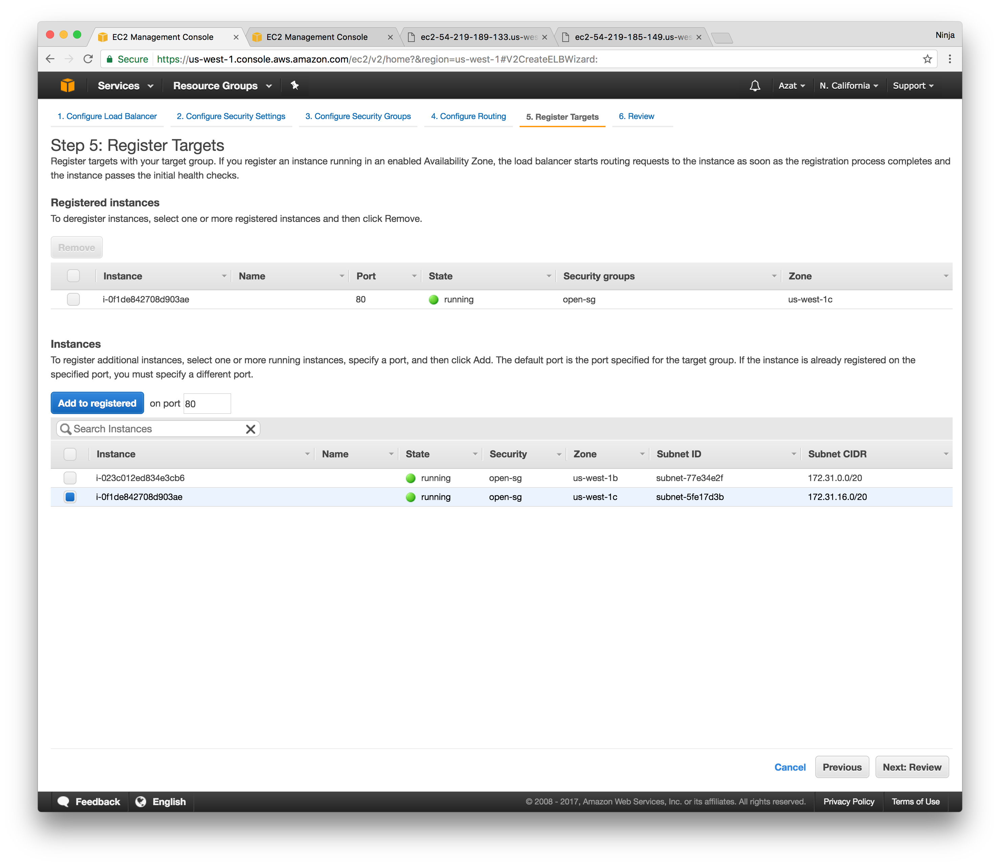

# Lab 5: Pager Duty


In startups and medium-size companies it's not uncommon for software engineers to serve pager duty. That's partially because there's very little dedicated IT Ops resources and partially because pager duty might make engineers to be more responsible and *feel* the pain of their bugs.

Luckily, since your tech stack is built on AWS, you can take advantage of the automation with launch configurations and autoscaling groups. You can monitors any spikes in traffic or any other metric like failures, CPU load or not having enough disk space and then scale up or down accordingly.

# Task

* Create an autoscaling group and launch an instance
* Have autoscaling group launch an instance when CPU load is > 15% for 1 min on the instance in the launch group.


# Walk-through

If you would like to attempt the task, then skip the walk-through and go for the task directly. However, if you need a little bit more hand holding or you would like to look up some of the commands or code or settings, then follow the walk-through.

This is a high-level overview of what you'll be doing:

1. Create a launch configuration with 1 Node app with user data to start an HTTP server (config from lab 2, user data has modified Node Hello Wolrd app)
1. Create an autoscaling group
1. Create an autoscaling policy to increase instances by 1 when CPU load is > 15% for 1 min
1. Load test it with loadtest npm module to see a new instance is created
1. Remove autoscaling group
1. Terminate instances

Next are the details.

## 1. Create an EC2 Launch Configuration for One Instance

Log in to the web console (use us-west-1 N California region) and navigate to the EC2 dashboard. Select "Launch Configuration" to start the wizard.



The Launch Configuration wizard is *very* similar to the Launch instance wizard. You will need to specify image(s), instance(s) type(s), volume(s), etc.

On the first screen of the instance wizard, find in Quick Start Amazon Linux. We recommend using *"Amazon Linux 64-bit, HVM, SSD, EBS"* because it's eligible for free tier on **t2.micro**.


On the next screen *2. Choose an instance type*, select "t2.micro" (Free tier eligible).

Select Next to proceed to the step *3 Create Launch Configuration*. Enter the configuration name (arbitrary, could be foobar, but try to give it a meaningful name). Now configure the User Data which will install and run Node web server. The code was made slow so we can test autoscaling easier. To do so open Advanced settings as shown on the screen capture below:


Paste the following code for bash command into User Data. For bonus, change the Hello World to Hello {YOUR_NAME}.


```bash
#!/bin/bash -ex
# output user data logs into a separate place for debugging
exec > >(tee /var/log/user-data.log|logger -t user-data -s 2>/dev/console) 2>&1
# get node into yum
curl --silent --location https://rpm.nodesource.com/setup_6.x | bash -
# install node (and npm) with yum
yum -y install nodejs
# install pm2 to restart node app
npm i -g pm2@2.4.3
# get source code for SLOW node server from GitHub's gist (could be private GitHub repo or private S3)
curl "https://gist.githubusercontent.com/azat-co/ee4038e32db3581b8b4fb34ef15ff00d/raw/e74557029d0acdc2d9dab0d90c5172ebcf29a649/slow-hello-world.js" > /home/ec2-user/hello-world-server.js
sudo chmod 755 /home/ec2-user/hello-world-server.js # optional
# restart pm2 and thus node app on reboot
crontab -l | { cat; echo "@reboot sudo pm2 start /home/ec2-user/hello-world-server.js -i 0 --name \"node-app\""; } | crontab -
# start the server with sudo because it is port 80, not 3000
sudo pm2 start /home/ec2-user/hello-world-server.js -i 0 --name "node-app"
```

**Leave other fields default on step 3.** Also, leave screen 4 (storage) with default settings.


On the step 5: Security Groups Add have *at the very least* these protocols and ports open:

* HTTP 80
* HTTPS 443
* SSH 22

Review everything and select **Create launch configuration**.

If you are curious, here's the code for the slow Node Hello World server. I intentionally put a for loot there to consume extra CPU cycles. 😈

```js
const port = 80
require('http')
  .createServer((req, res) => {
    console.log('url:', req.url)
    console.log('now we will slow down and block and consume CPU...')
    for (var i=0; i< 1000000; i++) {}
    res.end('hello world')
  })
  .listen(port, (error)=>{
    console.log(`server is running on ${port}`)
  })
```

Note: Don't forget to select an existing key pair for which you have the private key saved or create a new key pair and *download* the private key.

## 2. Create autoscaling group

Once you create the launch configuration (think of it as a blue print), create an autoscaling group. On the first screen *1. Configure Auto Scaling group details*, select the following:

* Group name: pick something arbitrary but meaningful, e.g., my-awesome-httpd-autogroup
* Group size: 1
* Network: default
* Subnet: us-west-1b and us-west-1c (make sure you are in us-west-1 region)
* Advanced | Load Balancing: ✔️ Check (Receive traffic from one or more load balancers)
* Health Check Grace Period: 1second
* Others: leave default

On *2. Configure scaling policies* select "Use scaling policies to adjust the capacity of this group" - of course we want to have the auto scaling! :)

Now you should see the range (max and min instances) and two policies. Increase the max range to 2 as shown in the screenshot... then create two policies: increase and decrease which will increase and decrease instance count by 1 when average CPU load is higher and lower than 15% for 1 min respectively.

You will need to create two alerts (AWS CloudWatch). You can do it right from this screen (see screencaptures). Make sure to use 1minutes, otherwise you'll have to wait *longer* for the alert to kick in (15min, 1hour, etc.).


And this is the decrease alert which is basically the opposite of the increase alert. You don't have to set up notification but it's rather easy to do if you want to get email (or any other) alerts via AWS SNS.


The end result should look like this with 2 policies and their alerts (and instance range 1-2):



Select Next and skip (leave empty) *3. Configure Notifications*. On *4. Configure Tags*, fill tag with  named role with value "aws-course".

On *5. Review*, review everything and then select "Create Auto Scaling group".

Select "Close" to get back to the EC2 dashboard... on the Auto Scaling Groups, you'll see a new instance in the bottom menu (Instances tab) as shown below:



You can click on the instance ID or find it in the Instance. Copy the public URL for the newly created EC2 instance. Paste it in the browser to navigate to the web server. You'll see the index.html page with the "This is my cool HTML page" heading.

Alternatively, execute curl from your developer machine to see the HTML response:

```
curl PUBLIC_URL
```

## 2.a. Create App Load Balancer and Add Target Group (Optional - Lab 4 is on ELB)

The next lab will be all about ELB, but if you are already familiar with ELB, then implement app ELB, add target group and attache it to the autoscaling group.

First, create an app ELB (not classic) from the EC2 console. Select public and IPv4 and proper listeners to open port 80 (at least). Then, pick a name for the new target group as shown below.



On the next step, register the instances launched by your autoscaling group (use ID if you have more than one instance running). See sceenshot as an example—your IDs and names *can and probably will* vary:



Lastly, associate this target group (ELB) with your autoscaling group by editing your autoscaling group and adding the target group by name (there would be an auto complete drop down). Ignore the field "Load balancers". That's for the classic ELB and we are using app ELB. See an example below:


Again. This step is optional because we are really working an an autoscaling group but typically developers use ELB with autoscaling feature so that's why there's this step 2.a. but it's optional. We will do another lab just on ELB soon.

## 3. Stress Test Web server

If you did step 2.a., then use the LB URL (DNS name). If you skipped 2.a. that means you don't have a load balancer so just use the DNS or public IP of your single instance under the autoscaling group.

Stress test the heck of your web server for at least one minute and then check in the EC2 console that the new instance was launched by the autoscaling group.

I recommend using loadtest library which is light weight CLI tool written in Node and available via npm. To install loadtest, simply (assuming you have Node and npm—npm comes with Node) run in your terminal / command prompt:

```
npm i -g loadtest@2.3.0
```

You can also use Apache ab or JMeter. Good tools for stress testing but not as simple as loadtest in my opinion.

The run the stress test with this command (my LB URL is my-httpd-lb-1208730027.us-west-1.elb.amazonaws.com):

```
loadtest -c 100 --rps 200 http://my-httpd-lb-1208730027.us-west-1.elb.amazonaws.com
```

Or if you don't use ELB, the command will look something like this

```
loadtest -c 100 --rps 200 http://ec2-54-183-255-49.us-west-1.compute.amazonaws.com
```

Keep in mind that because the port is 80, there's no need to specify it in the URL (like we did with 3000 in the previous lab). 80 is the default port for HTTP.

In the command above `-c` means concurrency and `--rps` means requests per second for each client. 100 and 200 should give enough troubles to t2.micro instance to ramp up the CPU load to hit the 15% threshold. This in turn will trigger the alarm to increase instance count by one. Wait for 1 min (make sure you alert period is 1 min). Go to EC2 console and check for the new instance create by the auto group. Adjust rps and concurrency as needed if the alarm hasn't been triggered.

If you used ELB (2.a.) then CPU load will decrease and decrease alert might be triggered with time.  If you didn't implement ELB, then simple stop stress testing and observed the removal of one instance so the total count is back to one.

To avoid extra charges or running out of the trial compute time, terminate the autoscaling group first, thin EBL and target groups (if you implemented them) and then instances. If you terminate instances first, autoscaling group will spawn new instances to get to the desired size.


# Troubleshooting

**No new instances**: If you need to edit an alert because you noticed a mistake (maybe you forgot to select 1 min instead of 15min), you can still edit the alert but you'll need to open a new tab and navigate to the AWS CloudWatch | Alerts. Find that alert by the name and edit it there, then come back and review.

**No Hello World**: SSH to the EC2 instance and find the node process by

```
ps aux | grep node
```

You might see something like this:

```
[ec2-user@ip-172-31-2-188 ~]$ ps aux | grep 'node'
root      2668  1.8  2.6 909804 27416 ?        Sl   03:52   0:00 node /home/ec2-user/hello-world-server.js
ec2-user  2681  0.0  0.2 110460  2188 pts/0    S+   03:52   0:00 grep --color=auto node
```

Also, check security group to see if port 80 is open for HTTP.
